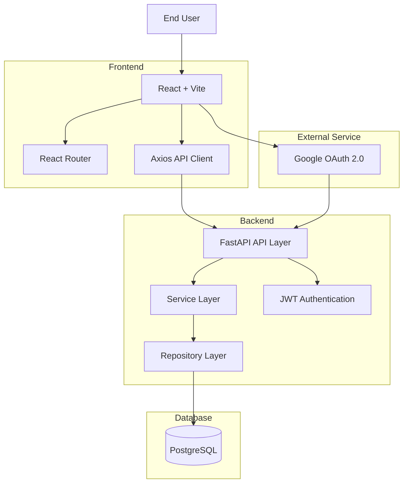
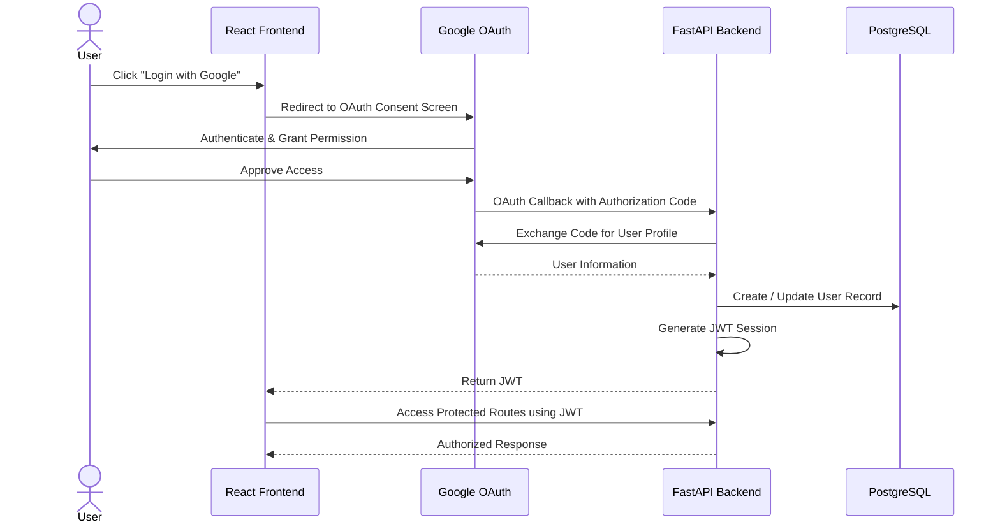

# System Architecture & Authentication Flow

This document describes the overall architecture of the Workflow Approval Management System and the authentication flow implemented using Google OAuth 2.0 and JWT-based sessions.

---

# 🏗️ System Architecture Diagram



---

# 🔐 Authentication Flow



---

# 📋 Architecture Overview

## Frontend

The frontend is built using:

* React.js
* Vite
* React Router
* Axios

Responsibilities:

* User authentication initiation
* Dashboard rendering
* Request creation and management
* Reviewer workflows
* Protected route handling

---

## Backend

The backend is built using:

* FastAPI
* SQLAlchemy ORM
* PostgreSQL

The backend follows a layered architecture:

```text
API Layer
    ↓
Service Layer
    ↓
Repository Layer
    ↓
Database Layer
```

Responsibilities:

* Google OAuth integration
* JWT generation and validation
* Request lifecycle management
* Reviewer approval/rejection workflow
* Business rule enforcement
* Database operations

---

## Database

PostgreSQL stores:

### Users

* id
* name
* email
* google_id
* role
* created_at

### Approval Requests

* id
* title
* description
* priority
* status
* created_by
* reviewer_id
* created_at
* updated_at

### Review Actions

* id
* request_id
* action
* comments
* reviewed_by
* reviewed_at

---

# 🔄 Request Lifecycle

The system enforces the following state transitions:

```text
PENDING
 ├──> APPROVED
 └──> REJECTED
```

Invalid transitions are blocked by the Service Layer.

Examples:

* APPROVED → REJECTED ❌
* REJECTED → APPROVED ❌
* APPROVED → PENDING ❌
* REJECTED → PENDING ❌

---

# ✅ Assessment Requirement Mapping

| Requirement          | Implementation                        |
| -------------------- | ------------------------------------- |
| FastAPI              | REST API Backend                      |
| SQLAlchemy ORM       | Database Access Layer                 |
| PostgreSQL           | Relational Database                   |
| React.js             | Frontend Application                  |
| Vite                 | Build Tool                            |
| React Router         | Client-Side Routing                   |
| Axios                | API Communication                     |
| Google OAuth 2.0     | Authentication                        |
| JWT Session          | Protected Access                      |
| Role-Based Access    | Requester / Reviewer                  |
| Layered Architecture | API → Service → Repository → Database |
| Testing              | Pytest + React Testing Library        |

---

This architecture is designed to be modular, maintainable, testable, and aligned with the requirements of the Csyrus Technologies Engineering Internship Assessment.
